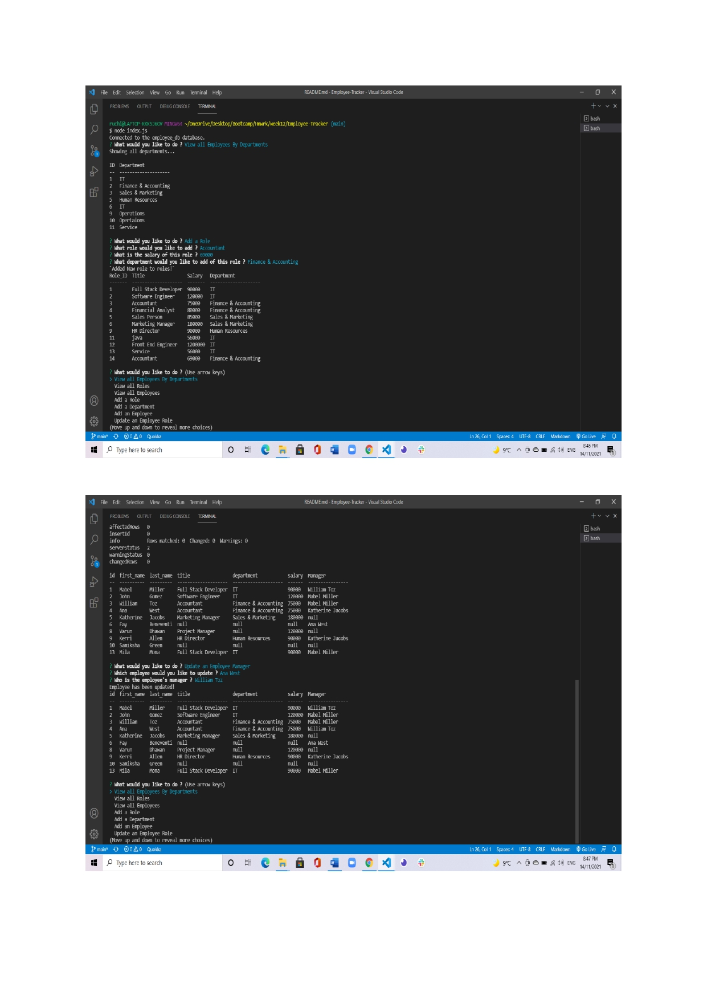

# Employee-Tracker (CMS)

## Description 
A command-line application to manage a company's employee database, using Node.js, Inquirer, and MySQL.

## Table of Contents
* [Installation](#installation)
* [Usage](#usage)
* [Screenshots](#screenshots)
* [Links](#links)
* [Contributing](#contributing)
* [Tests](#tests)

## Installation 
The user should clone the repository from GitHub. This application requires Node.js, Inquirer, console.table and mysql2. To run the application, use the command `node index.js`. To view database from MySQL, use the command ` mysql -u root -p`. 

## Usage 
This application will allow users to view, add, and edit employees, roles, departments & managers and can also view the budgets. 

View walk through video here to demonstrates the usage of application -[Screencastify](https://watch.screencastify.com/v/Ur9cYNkEshfjNab1uQb8)

## Screenshots 

# Links
* [The URL of the GitHub repository](https://github.com/Ruchi479/Employee-Tracker.git)

## Contributing 
Contributors should read the installation section. 

## Tests
There are no tests for this application. 
